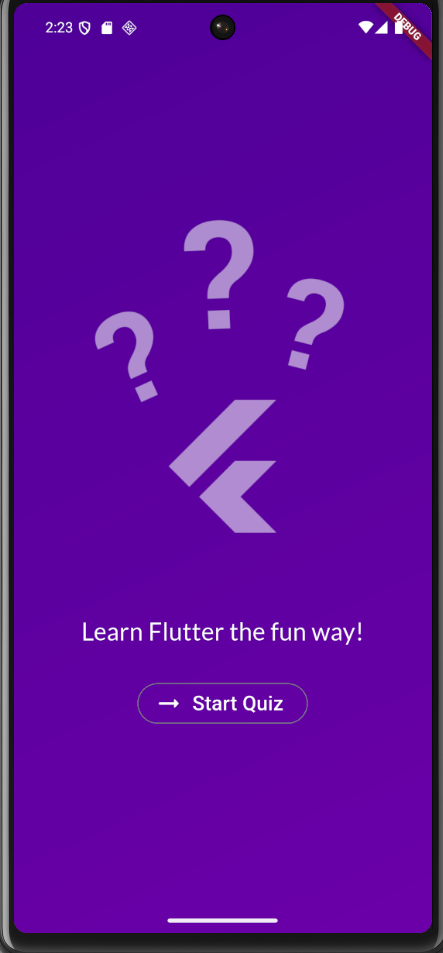
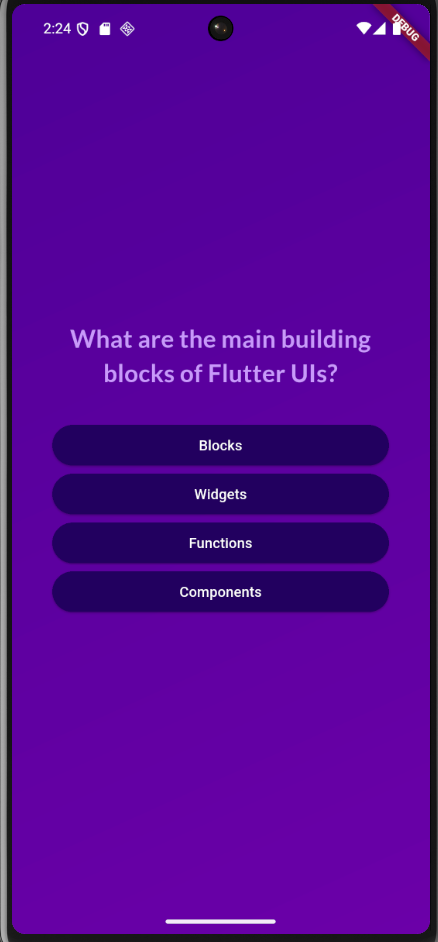
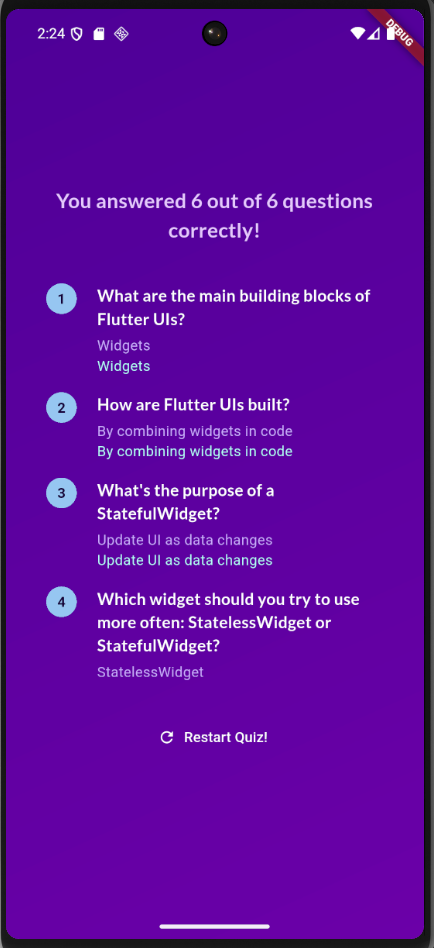

# Quiz App

A simple and interactive quiz application built with Flutter.

## Features

- Multiple choice questions
- Score tracking
- Responsive UI for mobile devices
- Easy to extend with new questions

## Getting Started

### Prerequisites

- [Flutter SDK](https://docs.flutter.dev/get-started/install)
- [Dart SDK](https://dart.dev/get-dart) (usually included with Flutter)
- An IDE like [VS Code](https://code.visualstudio.com/) or [Android Studio](https://developer.android.com/studio)

### Installation

1. **Clone the repository:**
   ```sh
   git clone https://github.com/your-username/quiz_app.git
   cd quiz_app
   ```
2. **Install dependencies:**
   ```sh
   flutter pub get
   ```
3. **Run the app:**
   ```sh
   flutter run
   ```

## Usage

- Select the correct answer for each question.
- Navigate between questions using the next and back buttons.
- Submit your answers to see your score.

## Contributing

1. Fork the repository
2. Create a new branch (`git checkout -b feature/YourFeature`)
3. Make your changes
4. Commit your changes (`git commit -m 'Add some feature'`)
5. Push to the branch (`git push origin feature/YourFeature`)
6. Create a new Pull Request

## License

This project is licensed under the MIT License - see the [LICENSE](LICENSE) file for details.

## Acknowledgments

- Inspired by various quiz apps
- Built with Flutter, Dart, and a passion for learning

## Screenshots

Add screenshots of your app below to showcase the UI:

| Start Screen           | Question Screen         | Result Screen           |
|------------------------|------------------------|-------------------------|
|  |  |  |

> Place your screenshots in a `screenshots/` folder at the root of the project and update the file names above if needed.
